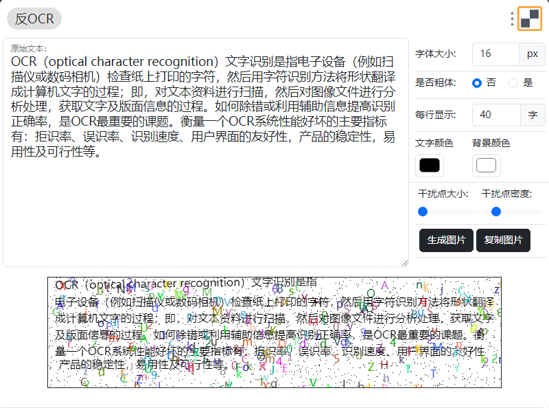

# 反OCR工具
## 工具介绍
这是一个用于对抗OCR工具的工具，可以将文本转换为图片，在转为图片的同时，加入干扰线，干扰点、文字、线条、背景等，从而提高聊天软件OCR识别的难度。
用于传输敏感信息，比如密码，避免被识别。

## 使用方法
输入需要转换的文本，点击生成图片按钮即可

## 演示效果

## 优化内容：
工具基于 [yuzu233/anti-ocr: 對抗文字識別 (github.com)](https://github.com/yuzu233/anti-ocr) 二次开发  

这个工具的想法在几年前就有，算是与和作者不谋而合，几年前自己用php GD库写过一个版本。没法集成到utools中，发现了上面这个js版本，就二次开发了一下。  

加入了一些新的功能，优化了界面，加入了utools的支持。

### TODO

- [x] 1. 优化界面，加入了bootstrap的样式
- [x] 2. 支持utools工具插件
- [ ] 3. 支持图文混排
